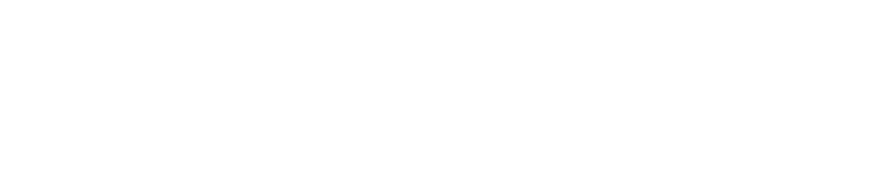

  

  <strong>AI-Powered Mentorship Platform for Entrepreneurs</strong>

---

A prototype platform for The Overlooked Founders — an initiative backing high-potential founders from lower socioeconomic backgrounds through an 8-week AI-powered mentorship programme.

**What it does:**

- RAG-powered "Ask a Mentor" chat — hybrid vector + keyword search with context-aware retrieval
- AI feedback pipeline — video transcription (Whisper) + knowledge-grounded mentorship feedback
- Application scoring — AI-assessed applications with optional video pitch analysis
- Admin dashboard — knowledge base CRUD with auto-chunking + embedded video playback
- Participant dashboard — weekly video submissions, progress tracking, AI feedback

**Stack:**

- **Frontend:** React, TypeScript, Vite, Tailwind CSS v4
- **Backend:** Python, FastAPI, sentence-transformers (all-MiniLM-L6-v2)
- **Infrastructure:** Supabase (Postgres + pgvector + Auth + Storage), Groq (Llama 3.3 70B + Whisper)
